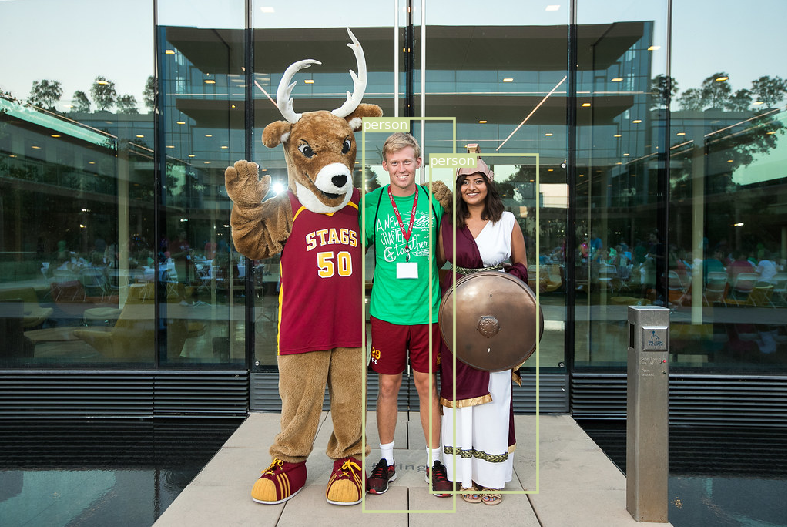
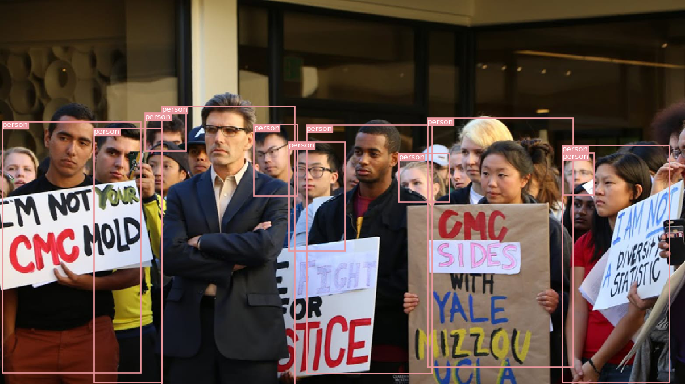
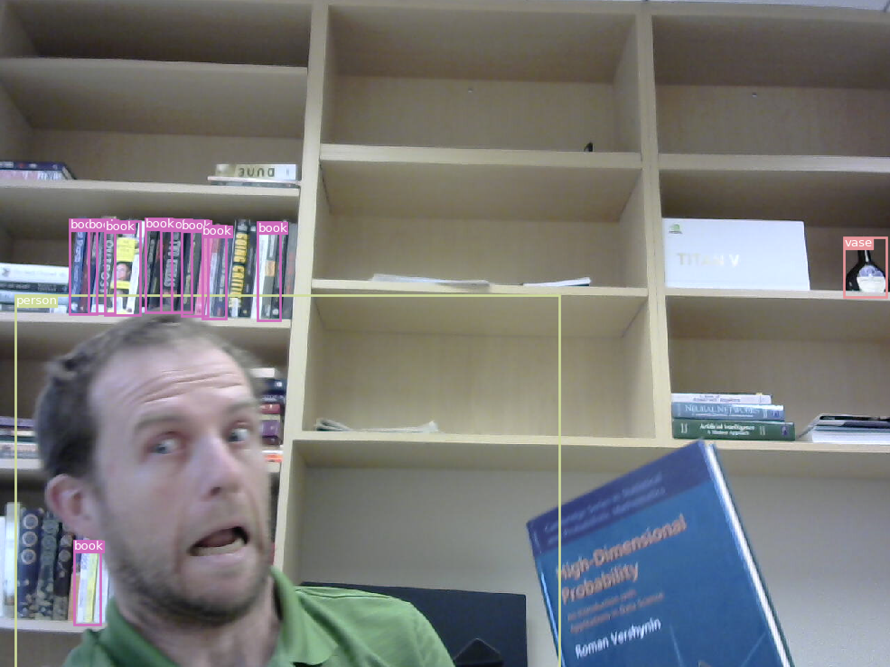
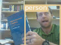
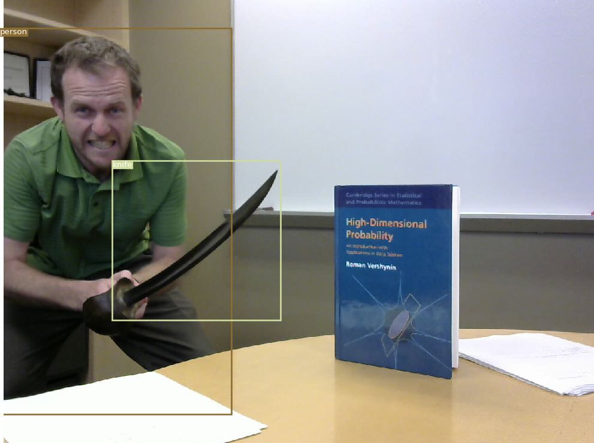
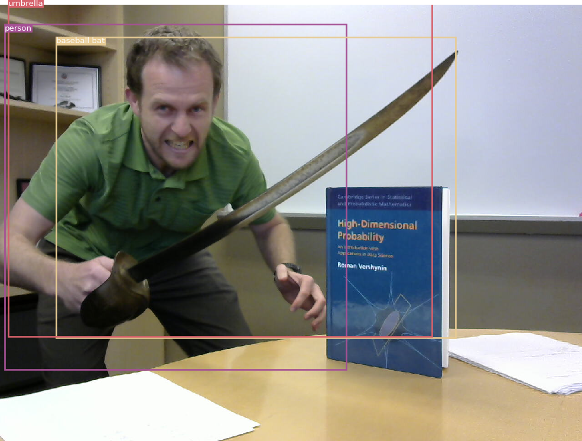
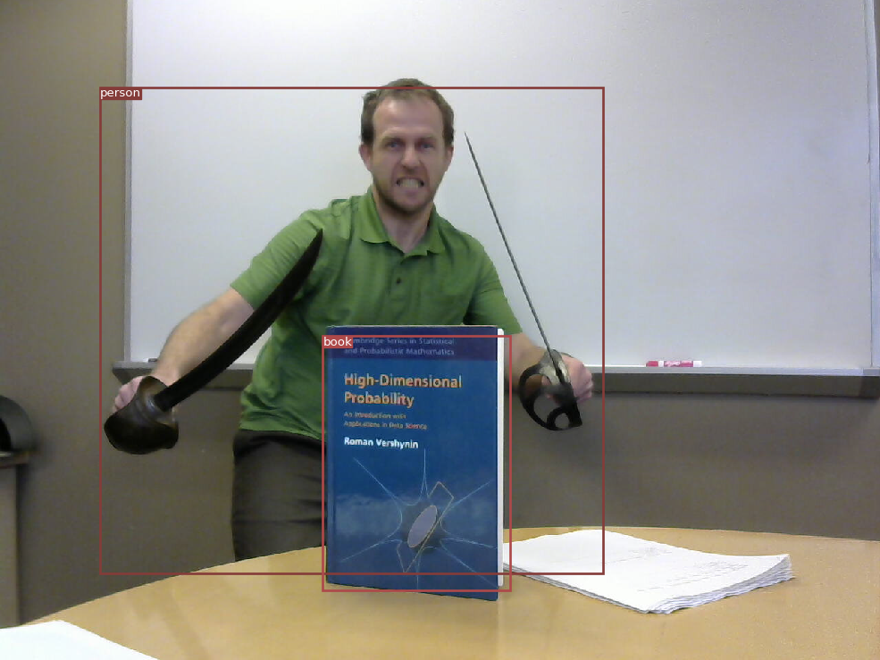

# YOLOv3 lol

**Due:** Tuesday, 3 March at midnight

**Learning Objective:**

1. use other people's implementations of pytorch models
1. gain familiarity with YOLO

## Tasks

You are required to complete the following tasks:

1. [This github repo](https://github.com/eriklindernoren/PyTorch-YOLOv3) contains a pytorch implementation of YOLOv3.
   Follow the directions to apply the YOLO object detection model to several of your own images.
1. Adjust the code so that it outputs images at their original resolution by changing line to read
   ```
   fig, ax = plt.subplots(1,figsize=(img.shape[1]/96, img.shape[0]/96), dpi=96)
   ```
1. Upload your favorite images to sakai.

Example images I created are:

<p align=center></p>
<p align=center></p>
<p align=center></p>
<p align=center></p>
<p align=center></p>
<p align=center></p>
<p align=center></p>

### Optional

You are not required to complete the following tasks,
however they are good exercises to get you familiar with pytorch.

1. The code resizes all images before passing it to the YOLO model using the size specified by the `--img_size` parameter.
   Experiment with different values of this parameter to see the effects on the outputs.
   You should notice that smaller images result in fewer objects detected,
   but larger images require more computation.

## Submission

Upload your images to sakai.
You do not need to upload any code.

